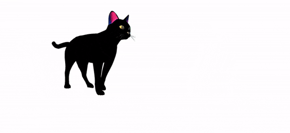
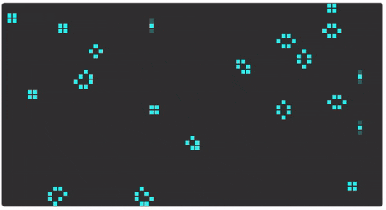

# Homework Browsers Week 1

## Exercises

The homework for this week can be found in the `homework` folder.

## Exercise 1: The book list

**Folder**: `ex1-bookList`

I'd like to display my three favorite books inside a nice webpage!

```js
const books = [
  {
    title: 'The Design of Everyday Things',
    author: 'Don Norman',
    alreadyRead: false,
  },
  {
    title: 'The Most Human Human',
    author: 'Brian Christian',
    alreadyRead: true,
  },
  {
    title: 'The Pragmatic Programmer',
    author: 'Andrew Hunt',
    alreadyRead: true,
  },
];
```

1. Iterate through the array of books.
2. For each book, create a `<p>` element with the book title and author and append it to the page.
3. Use a `<ul>` and `<li>` to display the books.
4. Add an `` to each book that links to a URL of the book cover.
5. Change the style of the book depending on whether you have read it (green) or not (red).

The end result should look something like this:
<https://hyf-js2-week1-makeme-ex1-demo.herokuapp.com/>

## Exercise 2: About me

**Folder**: `ex2-aboutMe`

Given this HTML:

```html
<!DOCTYPE html>
<html lang="en">
  <head>
    <meta charset="UTF-8" />
    <meta name="viewport" content="width=device-width, initial-scale=1.0" />
    <title>Document</title>
  </head>
  <body>
    <h1>About Me</h1>
    <ul>
      <li>Nickname: <span id="nickname"></span></li>
      <li>Favorite food: <span id="fav-food"></span></li>
      <li>Hometown: <span id="hometown"></span></li>
    </ul>
    <script src="index.js"></script>
  </body>
</html>
```

1. Using JavaScript, change the body tag's style so it has a font-family of "Arial, sans-serif".
2. Using JavaScript, replace each of the spans (`nickname`, `fav-food`,`hometown`) with your own information.
3. In JavaScript, iterate through each `<li>` and change the class to `list-item`.
4. Inside the HTML file `<head>` tag, add a style tag that sets a rule for `.list-item` to make the color red. Do this manually (i.e., not with JavaScript).

## Exercise 3: The logo hijack

**File**: `ex3-hijackLogo.js`

No homepage is safe from the logo bandit! Every time he sees a Google Logo he replaces it with a logo from HackYourFuture instead: <https://www.hackyourfuture.dk/static/logo-dark.svg>.

In this exercise you're expected to write a JavaScript function that can be executed in the console of the [Google website](https://www.google.com).

1. Find out how to select the element that contains the Google logo, and store it in a variable.
2. Modify the `src` and `srcset` of the logo so that it's replaced by the HackYourFuture logo instead.

## Exercise 4: What's the time?

**Folder**: `ex4-whatsTheTime`

Why wear a watch when you can check the time, live in your webpage?

1. Inside the `index.js`, complete the `addCurrentTime` to add the current time to the webpage. Make sure it's written in the HH:MM:SS notation (hour, minute, second). Use `setInterval()` to make sure the time stays current.
2. Have the function execute when the browser has finished loading the page.

## Exercise 5: The cat walk

**Folder**: `ex5-catWalk`

Start with this webpage, which has a single img tag of an animated GIF of a cat walking.

```html
<!DOCTYPE html>
<html lang="en">
  <head>
    <meta charset="UTF-8" />
    <meta name="viewport" content="width=device-width, initial-scale=1.0" />
    <title>Cat Walk</title>
    <style>
      img {
        position: absolute;
      }
    </style>
  </head>
  <body>
    
    <script src="index.js"></script>
  </body>
</html>
```

1. Create a variable to store a reference to the `` element.
2. Change the style of the `` to have a `left` of `0px`, so that it starts at the left hand of the screen.
3. Complete the function called catWalk() to move the cat 10 pixels to the right of where it started, by changing the `left` style property.
4. Call that function every 50 milliseconds. Your cat should now be moving across the screen from left to right. Hurrah!
5. When the cat reaches the right-hand of the screen, restart them at the left hand side (`0px`). So they should keep walking from left to right across the screen, forever and ever.
6. Each time when the cat reaches the middle of the screen, replace the img with an image of a cat dancing (use this URL: <https://media1.tenor.com/images/2de63e950fb254920054f9bd081e8157/tenor.gif>), keep it dancing for 5 seconds, and then replace the img with the original image and have it continue the walk.

This is what it should like:

> 

## Exercise 6: Conway's Game of Life

**Folder**: `ex6-gameOfLife`

In this exercise you will work with existing, working code for which you are asked to implement an enhancement. The application is a JavaScript version of a classic simulation, called [Conway's Game of Life](https://en.wikipedia.org/wiki/Conway%27s_Game_of_Life).

From Wikipedia:

> The Game of Life, also known simply as Life, is a cellular automaton devised by the British mathematician John Horton Conway in 1970. It is a zero-player game, meaning that its evolution is determined by its initial state, requiring no further input. One interacts with the Game of Life by creating an initial configuration and observing how it evolves.

As illustrated in the picture below, the game is a two-dimensional grid where cells come alive and die, depending on certain rules. These rules as summarized in the Wikipedia article as follow:

1. Any live cell with two or three live neighbors survives.
2. Any dead cell with three live neighbors becomes a live cell.
3. All other live cells die in the next generation. Similarly, all other dead cells stay dead.

In the exercise code a new generation of cells replaces the previous one every 200ms. For each cell of the new generation life or death is determined by applying the above rules on the state of that same cell in the current generation.

> 

### Code walk-through

<!--prettier-ignore-->
| Function | Description |
|----------|-------------|
| `createCell()` | Creates a JavaScript object representing a cell with `x` (column number) and `y` (row number) properties and a boolean `aLive` property that is randomly initialized to `true` or `false`. |
| `createGame()` | Creates the game "engine". When the function returns, its inner functions retain access to its parameters and the local `grid` variable through a closure. |
| `createGrid()` | Creates a two-dimensional array (i.e., an array of arrays) that represents a grid of cells that evolve over time. |
| `forEachCell()` | A higher-order function that takes a callback as its parameter. The callback is called for each cell in the two-dimensional grid array. |
| `drawCell()` | Takes a cell object as a parameter and draws the cell on the canvas. The visual representation depends on whether the cell is alive or dead. |
| `isAlive()` | Determines whether a cell at the given coordinates is alive or dead. The coordinates could potentially be off-grid. Off-grid cells are presumed dead. The function returns one if the given cell is alive or zero if its dead. |
| `countLivingNeighbors()` | Counts the number of living neighbors for a given cell. Each cell has eight neighbors, some of which may be off-grid if the cell is located at an edge or a corner of the grid. |
| `updateGrid()` | Iterates through all cells of the grid and computes the new state of each cell by applying the rules of the Game Of Life. |
| `renderGrid()` | Iterates through all cells of the grid and draws each cell onto the canvas. |
| `gameLoop()` | Executes one life cycle of the game (i.e., `updateGrid()` followed by `renderGrid()`) and then reschedules itself to run again after a delay. |
| `main()` | Resizes the canvas to the desired size and then creates and starts the game engine. The function `main()` itself is executed when the browser has finished loading the page. |

### Exercise

In the supplied JavaScript code the color of all living cells is a single shade of blue. This is in contrast to the illustration above where living cells have different shades of blue, depending on their life time. Your job is as follows:

1. In function `createCell()`, add a numeric `lifeTime` property to the object and assign it the value of one if the cell is initially alive or zero if it is initially dead.

2. In function `drawCell()`, add an `opacity` parameter to the `rgb()` value like this:

   ```js
   context.fillStyle = `rgb(24, 215, 236, ${opacity})`;
   ```

   The `opacity` of each rendered cell should depend on the cell's `lifeTime` property, as specified in this table:

   | lifeTime | opacity |
   | :------: | :-----: |
   |    1     |  0.25   |
   |    2     |   0.5   |
   |    3     |  0.75   |
   |    4+    |    1    |

3. In function `updateGrid()` add code to update the `lifeTime` value of each cell:

   - A living cell that remains living should have its `lifeTime` incremented by one.
   - A living cell that dies should have its `lifeTime` reset to zero.
   - A dead cell that is brought to life should have its `lifeTime` reset to one.

Here is a visual check that you can use to verify that the life time enhancement is correctly implemented. Most of the time, if you wait long enough, the game will "stabilize" to "still life" and "oscillator" patterns, as shown in the GIF below (see the Wikipedia article for more information about the Game Of Life patterns).

> 

- Cells in a still life pattern remain living indefinitely and should therefore stabilize at the highest opacity.

- The oscillating parts of an oscillator pattern continually switch between life and death and, when briefly living, should have the lowest opacity. The stable parts should be at the highest opacity.

_Have fun!_
