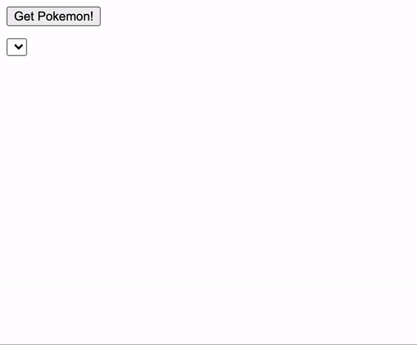

# Homework Using APIs Week 1

## Exercises

The homework for this week can be found in the `homework` folder.

### Exercise 1: John who?

### File: `ex1-johnWho.js`

Take a look at the following function (and try it out in your console):

```js
const getAnonName = (firstName, callback) => {
  setTimeout(() => {
    if (!firstName) {
      callback(new Error("You didn't pass in a first name!"));
      return;
    }

    const fullName = `${firstName} Doe`;

    callback(fullName);
  }, 1000);
};

getAnonName("John", console.log);
```

Rewrite this function, but replace the callback syntax with the Promise syntax:

- Have the `getAnonName` function return a `new Promise`.
- If the Promise `resolves`, pass the full name as an argument to resolve with.
- If the Promise `rejects`, pass an error as the argument to reject with: "You didn't pass in a first name!"

### Exercise 2: Is it a double digit number?

#### File: `checkDoubleDigits.js`

Complete the function called `checkDoubleDigits` such that:

- It takes one argument: a number
- It returns a `new Promise`.
- If the number between 10 and 99 it should resolve to the string "This is double digit number!".
- For any other number it should reject with an an Error object containing: "Expected a double digit number but got `number`", where `number` is the number that was passed as an argument.

### Exercise 3: Programmer humor

#### Folder: `ex2-programmerHumor`

Who knew programmers could be funny?

Write a program that makes an HTTP Request to: `https://xkcd.now.sh/?comic=latest`

1. Complete the function `getData()`. It should:

   - Take a `url` string as its parameter.
   - It should return a promise that resolves to the data returned from the Web API.
   - It should return a rejected promise in case of HTTP errors and/or network errors.

2. Complete the function body of the `.then()` method.

   - It should log the image data returned by `getData()` to the browser's console.
   - It should dynamically create an `` element and set its `src` property from the data.
   - It should append the `` element to the document's `<body>` element.

3. Complete the function body of the `.catch()` method.

   - It should log the error information to the browser's console.

### Exercise 3: Dog photo gallery

#### Folder: `dogPhotoGallery`

Let's make a randomized dog photo gallery!

Write a function that makes a HTTP Request to `https://dog.ceo/api/breeds/image/random`. It should trigger after clicking a button in your webpage. Every time the button is clicked it should append a new dog image to the DOM.

- Create an `index.html` file that will display your random image.
- Add two `<button>` and one `<ul>` element, either in the HTML or through JavaScript.
- Write two versions for the button functionality: one with `XMLHttpRequest`, and the other with `axios`.
- When any one of the two buttons is clicked it should make a HTTP Request to `https://dog.ceo/api/breeds/image/random`.
- After receiving the data, append to the `<ul>` a `<li>` that contains an `` element with the dog image.
- Incorporate error handling: log to the console the error message.

### Exercise 1: Promise me to wait

#### Folder: `ex1-promiseToWait`

In this exercise you'll practice refactoring `Promise` syntax into `async/await` + `try/catch` syntax. Rewrite exercise A & B using `async/await` + `try/catch` syntax.

```js
// Exercise A
function getData(url) {
  fetch(url)
    .then((response) => response.json)
    .then((json) => console.log(json))
    .catch((error) => console.log(error));
}

getData("https://randomfox.ca/floof/");

// Exercise B
const arrayOfWords = ["cucumber", "tomatoes", "avocado"];

const makeAllCaps = (array) => {
  return new Promise((resolve, reject) => {
    const capsArray = array.map((word) => {
      if (typeof word === "string") {
        return word.toUpperCase();
      } else {
        reject("Error: Not all items in the array are strings!");
      }
    });
    resolve(capsArray);
  });
};

makeAllCaps(arrayOfWords)
  .then((result) => console.log(result))
  .catch((error) => console.log(error));
```

### Exercise 2: Trivia time

Don't you just love trivia games? Let's make our own!

In this exercise you'll make use of the [Open Trivia Database API](https://opentdb.com/). You are going to fetch 5 random trivia questions and then inject them into the DOM, inside of an accordion. It should behave similar to this:


Here are the requirements:

- Create a folder called `trivia-app`, that includes an HTML, CSS and JavaScript file
- Link them all together in the HTML file
- Only provide the basic structure in the HTML file. All other DOM elements are to be created using JavaScript
- No CSS frameworks are allowed!
- Sometimes the strings you get back from the API contains HTML entities (like `&quote;`). Find out a way to turn this into regular text
- Make use of the following endpoint: <https://opentdb.com/api.php?amount=5>

### Exercise 3: Gotta catch 'em all

> Inside of your `homework` folder, create another folder called `pokemon-app`. There, create an `index.html` and `script.js` file

Let's catch all original 151 Pokemon in our own little web application! Here's an example of what you'll be building for this exercise:



In this exercise you're going to do several things:

1. Create and append DOM elements using JavaScript only
2. Fetch data twice from a public API [PokeAPI](https://pokeapi.co/)
3. Display the results in the DOM.

Here are the requirements:

- Create 3 functions: `fetchData`, `addPokemonToDOM` and `main`
- The `main` function executes the other functions and contains all the variables
- In the `fetchData` function, make use of `fetch` and its Promise syntax in order to get the data from the public API
- Execute the `main` function when the window has finished loading
